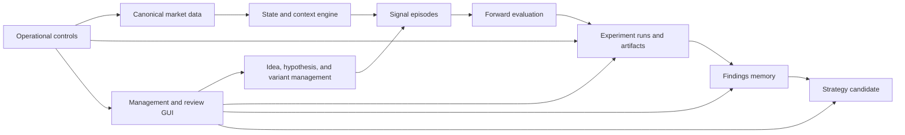
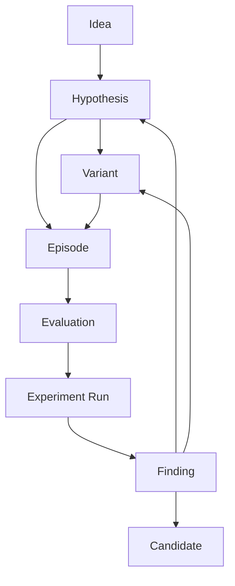

# Research Platform Architecture

## Status

- Issue: [#50](https://github.com/tgrytnes/TradeResearch/issues/50)
- Branch: `docs/50-research-platform-architecture`
- Status: draft foundation note

## Goal

Define the first durable architecture note for TradeResearch so future implementation work has a stable reference for system boundaries, domain ownership, source-of-truth rules, and the end-to-end research lifecycle.

This document is intentionally broader than a single story and narrower than a full implementation specification. It translates the planned epics and stories into a coherent platform shape.

## Audience

This document is for:

- maintainers shaping the initial platform
- implementers opening story-level issues under Epic 1 through Epic 12
- future AI agents that need a durable explanation of what exists, how major parts relate, and where detailed decisions still need follow-up notes

## Scope

In scope:

- system context and subsystem boundaries
- the shared domain model across workspace and research workflows
- the research lifecycle from idea to strategy candidate
- source-of-truth rules for data, metadata, artifacts, and findings
- traceability and reproducibility expectations
- cross-epic architectural relationships

Out of scope:

- final database schema
- API contracts
- UI wireframes
- task-by-task implementation detail
- deployment topology details beyond architectural constraints

## Architecture Principles

### 1. One platform, two tightly related concerns

TradeResearch is both:

- a private workspace and project-management system
- a trading-research platform

The architecture should not treat these as unrelated products. Shared workspace capabilities such as items, notes, tags, priorities, artifacts, and links are reused by research workflows rather than duplicated inside research-specific models.

### 2. Method-agnostic research support

The platform must support multiple research styles without forcing a redesign of the core model:

- rule-based research
- statistical analysis
- ML workflows
- transformer or sequence-model workflows
- graph-oriented workflows
- LLM-assisted interpretation and synthesis

The architecture therefore favors stable domain entities and versioned metadata over method-specific pipelines embedded directly into the core model.

### 3. Representation-aware design

The same underlying market reality may be consumed as raw events, derived features, state snapshots, sequences, graphs, or visual artifacts. The architecture must preserve relationships between these representations rather than allowing each workflow to define its own incompatible view of the market.

### 4. Traceability and reproducibility over convenience

Every meaningful result should be explainable through a durable chain:

market data -> representation -> hypothesis or variant -> episode -> evaluation -> run -> finding -> candidate

If a result cannot be traced through that chain, it should not be considered reliable research output.

### 5. Clear separation of concerns

The platform should separate:

- canonical market data preparation
- market-state computation
- research-definition management
- experiment execution
- evidence and findings capture
- user-facing review surfaces
- operational workflow and release controls

This separation reduces coupling and allows later implementation to evolve each layer independently.

### 6. Repository docs are part of the architecture

The repository is expected to carry durable architectural intent. This note is not optional project prose; it is part of the system's operating model and complements [docs/01-development-operating-system.md](../01-development-operating-system.md) and [docs/02-agent-memory-and-mcp-strategy.md](../02-agent-memory-and-mcp-strategy.md).

## System Context

At a high level, TradeResearch consumes market data, transforms it into reusable representations, applies research definitions, records experiment execution, captures findings, and supports human or AI-assisted review.

Primary actors and inputs:

- researcher using the platform to capture ideas, define hypotheses, run experiments, and review findings
- AI assistant helping with analysis, interpretation, and workflow acceleration
- external market-data source, initially described as SQL-backed raw tick or event data
- filesystem or artifact storage for graphs, images, exports, and other evidence objects

Primary outputs:

- structured research objects such as ideas, hypotheses, variants, runs, findings, and candidates
- reusable market representations and derived evidence
- reviewable artifacts and traceability records
- durable documentation of what was learned

## Subsystem Map

The planned epics imply the following top-level subsystems.

### A. Workspace Foundation

Driven mainly by Epic 1 and stories [#13](https://github.com/tgrytnes/TradeResearch/issues/13) through [#22](https://github.com/tgrytnes/TradeResearch/issues/22).

Responsibilities:

- generic item model
- statuses, priorities, tags, notes, links, and next actions
- project or workspace containers
- artifact attachment and graph metadata linkage

This subsystem provides shared object-management capabilities used by both generic workspace items and research-specific objects.

### B. Canonical Market Data Access and Preparation

Driven by Epic 2.

Responsibilities:

- raw event access from SQL
- canonical event schema
- cleaning, session boundaries, trading-day rules, and roll handling
- reusable, representation-ready market slices
- data quality diagnostics

This subsystem is the root of trust for market facts.

### C. Market State and Context Engine

Driven by Epic 3.

Responsibilities:

- derived microstructure features
- structured market state snapshots
- contextual tags such as volatility or session phase
- representation versioning
- reusable computation rules across methods

This subsystem converts canonical facts into reusable research representations.

### D. Hypothesis and Variant Management

Driven by Epic 4 and stories [#23](https://github.com/tgrytnes/TradeResearch/issues/23) through [#31](https://github.com/tgrytnes/TradeResearch/issues/31).

Responsibilities:

- idea intake and prioritization
- formalization into hypotheses
- assumptions and falsification criteria
- controlled variant creation
- lifecycle status management across the research funnel

This subsystem is the core definition layer for research intent.

### E. Signal Episode Detection

Driven by Epic 5.

Responsibilities:

- trigger logic execution
- episode start and end rules
- overlap and cooldown handling
- trigger-time state capture
- contextual tagging of episodes

This subsystem materializes research definitions into analyzable market episodes.

### F. Forward Outcome and Evaluation

Driven by Epic 6.

Responsibilities:

- forward horizon definitions
- target and path-outcome calculations
- regime-sliced evaluation
- robustness and sensitivity checks
- in-sample, validation, and holdout comparisons

This subsystem answers what happened after a detected episode.

### G. Experiment Execution and Tracking

Driven by Epic 7 and stories [#32](https://github.com/tgrytnes/TradeResearch/issues/32) through [#36](https://github.com/tgrytnes/TradeResearch/issues/36).

Responsibilities:

- run registration
- configuration and parameter capture
- metrics storage
- artifact attachment
- linking runs back to ideas, hypotheses, and variants
- tracking methods, representations, versions, partial runs, and failures

This subsystem is the audit log for research execution.

### H. Findings and Research Memory

Driven by Epic 8 and stories [#37](https://github.com/tgrytnes/TradeResearch/issues/37) through [#40](https://github.com/tgrytnes/TradeResearch/issues/40).

Responsibilities:

- recording findings and conclusions
- evidence strength and confidence
- next steps from results
- alternative explanations and unresolved questions
- narrative interpretation for both human and AI-assisted work

This subsystem preserves what was learned, not only what was run.

### I. Management GUI and Review Surfaces

Driven by Epic 9 and Epic 10 and stories [#41](https://github.com/tgrytnes/TradeResearch/issues/41) through [#47](https://github.com/tgrytnes/TradeResearch/issues/47).

Responsibilities:

- list and detail views
- idea pool and idea case-file views
- findings review
- graph and artifact browsing
- episode and evidence inspection
- representation-aware filtering and comparison

This subsystem exposes the platform's state to humans in a navigable way.

### J. Candidate Promotion

Driven by Epic 11 and stories [#48](https://github.com/tgrytnes/TradeResearch/issues/48) and [#49](https://github.com/tgrytnes/TradeResearch/issues/49).

Responsibilities:

- promotion criteria
- candidate registry
- strengths, weaknesses, assumptions, and open questions
- readiness and maturity tracking
- handoff boundary to later strategy-design work

This subsystem turns promising research into structured downstream opportunities.

### K. Operational Reliability and Delivery Workflow

Driven by Epic 12 and the delivery rules in [docs/01-development-operating-system.md](../01-development-operating-system.md).

Responsibilities:

- configuration and environment management
- logging and failure handling expectations
- testing strategy
- backup and recovery expectations
- release, review, and safe-change workflow

This subsystem is partly technical runtime architecture and partly delivery architecture.

## System Relationship Diagram

## Core Domain Model

The platform should be organized around a shared object model with research-specific specializations.

### Shared workspace entities

- **Workspace Item**: generic top-level managed object with identity, status, priority, tags, notes, links, and next action
- **Project Container**: grouping boundary for related items and research workspaces
- **Tag**: reusable classification label
- **Note**: time-ordered narrative or commentary entry attached to an item
- **Relation**: typed edge between items such as parent-child, related, blocked-by, derived-from
- **Artifact**: external or generated evidence object such as image, file, chart, or export
- **Graph Metadata**: structured description of graph-like or chart-like artifacts including origin, type, and linkage

### Research-definition entities

- **Idea**: informal but structured research concept with thesis, intuition, classification, mechanism, and alternative explanations
- **Hypothesis**: formal testable expression derived from an idea
- **Variant**: controlled modification of a hypothesis intended for comparison
- **Assumption Set**: explicit assumptions, falsification logic, and boundaries of validity

### Market-analysis entities

- **Canonical Event**: normalized representation of raw market activity
- **Market Slice**: reusable prepared subset of canonical events
- **State Snapshot**: computed market-state description at a given point in time
- **Context Tag**: derived regime or condition label associated with state, episode, run, or finding
- **Episode**: concrete signal occurrence produced from hypothesis or variant logic
- **Outcome Record**: computed forward path or target result for an episode

### Execution and evidence entities

- **Experiment Run**: one execution instance with method, representation, parameters, versions, timestamps, and status
- **Run Metric**: named metric attached to a run
- **Run Artifact**: artifact generated by or attached to a run
- **Finding**: durable interpretation or conclusion linked to evidence
- **Evidence Assessment**: strength, confidence, caveats, and uncertainties attached to a finding
- **Candidate**: promoted research object ready for downstream strategy-design consideration

## Relationship Model

The following relationships should be treated as first-class and durable:

- a project container groups many workspace items
- an idea may produce one or more hypotheses
- a hypothesis may produce one or more variants
- a hypothesis or variant may define one or more episode-detection rules
- an episode references the canonical market slice and state snapshot that existed at trigger time
- an evaluation attaches forward outcomes to an episode
- a run references the hypothesis or variant, the data scope, the representation, and the execution method used
- a run may generate many metrics and artifacts
- a finding references the runs, episodes, artifacts, and interpretations that support it
- a candidate is promoted from one or more findings and must retain links back to supporting evidence

## Research Lifecycle

The planned epics define a lifecycle that should remain visible across the system.

1. **Capture idea**
   - record intuition, mechanism, alternative explanations, and classification
2. **Prioritize and formalize**
   - triage idea, define hypothesis, and record assumptions or falsification rules
3. **Create variants**
   - explore controlled differences without losing parent lineage
4. **Detect episodes**
   - apply logic to prepared market data and materialize trigger events
5. **Evaluate outcomes**
   - compute forward results and robustness views
6. **Run experiments**
   - register execution context, metrics, artifacts, and failures
7. **Record findings**
   - capture what was learned, confidence, caveats, and next steps
8. **Review evidence**
   - inspect graphs, episodes, and artifacts in UI flows
9. **Promote candidate**
   - summarize readiness, constraints, and handoff information

The lifecycle is not strictly linear. Iteration is expected. However, the lineage between stages must remain durable.

## Lifecycle Diagram

## Source-of-Truth Rules

One of the main architectural risks in this platform is ambiguity about where truth lives. The system should adopt explicit boundaries.

### Raw market truth

Raw market facts live in the upstream SQL-backed source. TradeResearch may cache or prepare derived forms, but prepared outputs must remain traceable back to canonical event definitions.

### Canonical market truth inside the platform

Canonical event schemas, cleaning rules, session rules, and preparation logic define the platform's internal market truth. Any downstream feature, state, or sequence must be derivable from this layer.

### Research-definition truth

Ideas, hypotheses, variants, assumptions, statuses, and promotion states live in the platform's application data model rather than being implied from notebooks, ad hoc files, or UI state.

### Execution truth

Runs, parameters, execution status, metrics, and representation or model versions must live in the execution-tracking model. A chart or notebook output alone is not sufficient evidence that a run exists.

### Findings truth

Findings, confidence, alternative explanations, next steps, and candidate rationale must live in durable application records and linked documentation, not only in chat history, ephemeral notes, or artifact filenames.

### Artifact truth

Binary or rendered evidence may live in files or external object storage, but the metadata that identifies what the artifact is, how it was produced, and what it supports must live in the platform data model.

### UI state

Filters, selection state, sort order, and convenience views are not sources of truth. They are transient projections of durable underlying objects.

## Market Representation Strategy

Epics 2 and 3 require the platform to support many forms of representation without fragmenting truth.

The intended layered model is:

1. **Raw events**
   - closest view to source market activity
2. **Canonical events**
   - normalized, cleaned platform-wide representation
3. **Prepared slices**
   - session-aware or scoped subsets for downstream work
4. **Derived features**
   - reusable feature computations
5. **State snapshots**
   - structured descriptions of market state at a moment
6. **Sequences**
   - ordered inputs for temporal or transformer-style methods
7. **Visual or graph artifacts**
   - human-reviewable outputs or alternative structural representations

Each higher layer should preserve lineage to the lower layer and carry version identifiers where computation rules matter.

## Traceability Model

The architecture should enforce the following minimum lineage:

- which prepared market slice was used
- which representation definition and version was applied
- which idea, hypothesis, or variant motivated the run
- which episode rules produced the analyzed episodes
- which evaluation logic and horizon definitions produced outcome measures
- which run settings, models, prompts, or methods were used
- which artifacts and metrics were generated
- which findings cite which evidence
- which candidate promotion decision cites which findings and constraints

This traceability model is the basis for reproducibility, debugging, and honest interpretation.

## Artifact and Graph Architecture

Artifacts are not secondary attachments; they are evidence objects in the research system.

The architecture should treat artifacts as durable linked records with at least:

- stable identity
- type and subtype
- origin object and origin process
- creation time and producer
- storage reference
- representation or graph classification where relevant
- links to ideas, runs, findings, and candidates

Graph metadata should support at least two broad needs:

- technical provenance, so the system knows what produced the graph
- review utility, so the researcher can find and compare meaningful evidence later

Key-evidence marking from stories [#46](https://github.com/tgrytnes/TradeResearch/issues/46) and [#47](https://github.com/tgrytnes/TradeResearch/issues/47) implies that the architecture should support evidence prominence independent of storage location.

## Management and Review Architecture

The planned GUI is not a separate product layered on top of arbitrary data dumps. It is a structured projection of the underlying workspace and research models.

The UI architecture should be built around a small number of reusable views:

- generic item list
- generic item detail
- idea pool
- idea case file
- findings review
- evidence or graph inspection

The case-file concept is especially important. It should act as the researcher-facing aggregation boundary where ideas, hypotheses, variants, runs, findings, and evidence can be reviewed together.

## Candidate Promotion Architecture

Promotion to candidate should not be a label toggle. It is a boundary crossing from exploratory research into structured downstream use.

A candidate record should preserve:

- source idea, hypothesis, or variant lineage
- evidence summary
- strengths and weaknesses
- assumptions and failure regimes
- readiness or maturity level
- open questions and required next checks

This ensures downstream strategy-design work begins from explicit evidence rather than enthusiasm.

## Operational Architecture

Operational reliability is a cross-cutting concern rather than one isolated module.

### Configuration and environment

- separate configuration from code
- keep environment-sensitive values explicit
- version important research definitions and computation rules

### Testing

The system should eventually reflect the testing policy in [docs/01-development-operating-system.md](../01-development-operating-system.md):

- unit tests for pure logic and state derivation
- integration tests for boundaries such as storage and service composition
- e2e or smoke coverage for critical workflow paths

### Failure handling

- failed and partial runs should be first-class states
- logs and diagnostics should help explain data, state, or execution mismatches
- silent corruption is more dangerous than explicit failure

### Backup and recovery

- metadata and research conclusions are durable assets
- artifacts may be reproducible in some cases, but findings and lineage records should be protected as primary knowledge assets

## Epic-to-Architecture Mapping

| Epic | Architectural concern | Primary sections |
| --- | --- | --- |
| 1 | Shared platform foundation | subsystem map, core domain model, source-of-truth rules |
| 2 | Canonical data layer | system context, subsystem map, market representation strategy |
| 3 | Reusable market state | subsystem map, market representation strategy, traceability model |
| 4 | Idea to hypothesis workflow | core domain model, research lifecycle |
| 5 | Episode materialization | subsystem map, research lifecycle, traceability model |
| 6 | Honest forward evaluation | subsystem map, source-of-truth rules, traceability model |
| 7 | Run auditability | subsystem map, traceability model, operational architecture |
| 8 | Findings memory | core domain model, research lifecycle, source-of-truth rules |
| 9 | Management GUI | management and review architecture |
| 10 | Evidence inspection | artifact and graph architecture, management and review architecture |
| 11 | Candidate promotion | candidate promotion architecture |
| 12 | Reliability and workflow | operational architecture |

## Main Architectural Decisions Settled Here

- TradeResearch is one platform with shared workspace and research-specific capabilities.
- Canonical market data and derived representations are separate layers.
- Research objects and findings must live in durable platform records, not only in artifacts or chat.
- Runs, artifacts, findings, and candidates must preserve lineage back to underlying research definitions and data representations.
- Review surfaces are projections over durable domain objects, not their own source of truth.

## Open Decisions for Follow-up ADRs

Storage layout and source-of-truth split are now captured in `docs/architecture/adr-001-storage-and-source-of-truth.md`.

The following areas should likely become separate ADR-style notes as implementation continues:

1. exact shared-entity model for workspace items versus specialized research objects
2. versioning strategy for market representations, prompts, and model definitions
3. run-tracking schema and artifact provenance requirements
4. candidate-promotion criteria and readiness scale
5. deployment topology for local-only versus server-assisted operation

Existing ADR files:

- `docs/architecture/adr-001-storage-and-source-of-truth.md`

Recommended future files to create when those decisions are ready:

- `docs/architecture/adr-002-core-entity-and-lifecycle-model.md`
- `docs/architecture/adr-003-market-representation-strategy.md`
- `docs/architecture/adr-004-run-and-artifact-traceability.md`

## Implementation Guidance for Near-Term Stories

When story implementation begins, prefer this order:

1. shared workspace entities and relationship model from Epic 1
2. canonical market-data preparation boundaries from Epic 2
3. market-state and representation versioning from Epic 3
4. hypothesis and variant workflow from Epic 4
5. episode and evaluation lineage from Epics 5 and 6
6. run tracking and findings capture from Epics 7 and 8
7. management and inspection UI from Epics 9 and 10
8. candidate promotion and operational hardening from Epics 11 and 12

This ordering preserves architectural leverage and reduces rework.

## Summary

TradeResearch should be built as a layered research operating system rather than a narrow backtest tool. The platform's value depends on trustworthy market-data lineage, reusable state representations, explicit research definitions, traceable execution, durable findings, and structured promotion of strong ideas into candidate status.

This note establishes the architectural backbone for that direction and should be treated as the root reference for future implementation notes under `docs/architecture/`.
